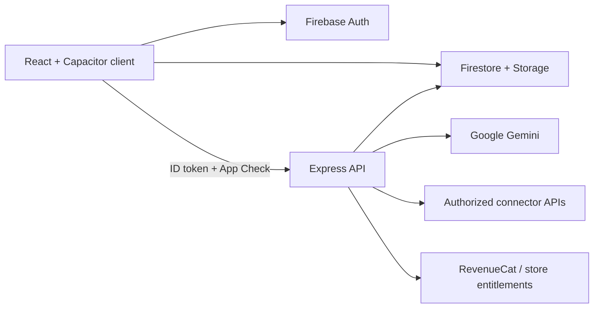

# Regrade

Regrade is an evidence-first student assistant for understanding marked work,
preparing respectful appeal drafts, and reviewing recurring mistakes. AI findings
are suggestions, not official grading decisions or guaranteed recovered marks.

Copyright 2026 Preston Jay Susanto. See `LICENSE`, `NOTICE.md`, and `docs/legal/`.

## Current state

The repository contains a React/Vite client, Capacitor iOS and Android shells, an
Express API, Firebase Auth/Firestore/Storage integration, a Gemini analysis/chat
pipeline, connector and import infrastructure, family pairing, notification,
subscription, and account-deletion services.

It is **pre-beta**. Firebase, AI, connectors, push, store purchases, and account
deletion all use real service paths and require environment setup plus end-to-end
verification. Missing services fail closed instead of returning synthetic success.
Read `docs/release/PRODUCTION_READINESS.md` before describing a connector as live.

## Commands

```bash
npm ci
npm --prefix server ci
npm run desktop          # laptop app: API + web UI + Electron window
npm run dev              # browser-only client (expects local API)
npm --prefix server run dev
npm run desktop:pack     # unpackaged Mac .app under release/
npm run desktop:dmg      # downloadable Mac DMG + zip
npm run lint
npm test
npm run build
npm --prefix server run lint
npm --prefix server test
npm run cap:sync
bash scripts/check-secrets.sh
```

## Architecture



- Client keys are limited to public Firebase/OAuth SDK identifiers.
- Gemini, Firebase Admin, connector encryption, cron, and billing secrets stay server-side.
- Firestore and Storage use default-deny, user-scoped rules.
- Appeals remain user-reviewed drafts; Auto Mode does not send externally.

## Connector truth

The UI has a searchable catalog of 39 sources. Implemented listing/import adapters
exist for Canvas, Google Classroom, Google Drive, Dropbox, and OneDrive. Scheduled
seven-day Auto Mode currently scans Canvas and Google Classroom. Gradescope, Apple
Files, and other manual sources use file import. Institution-gated entries remain
unavailable until a real school/vendor authorization exists.

See `docs/integrations/CONNECTOR_STATUS_MATRIX.md`.

## Configuration

Copy `.env.example` and `server/.env.example` locally; never commit populated files.
Static production hosts must set `VITE_API_BASE_URL`. The server fails production
startup when critical AI, Firebase Admin, App Check, encryption, cron, family, or
CORS configuration is unsafe or absent.

Detailed setup and release gates are indexed in `docs/README.md`.

## Security and privacy

Run `bash scripts/check-secrets.sh` before every push. Do not add student documents,
credentials, logs, screenshots of real grades, private school information, or local
filesystem paths. Report security issues using the contact in `src/version.ts` without
attaching sensitive educational records.
