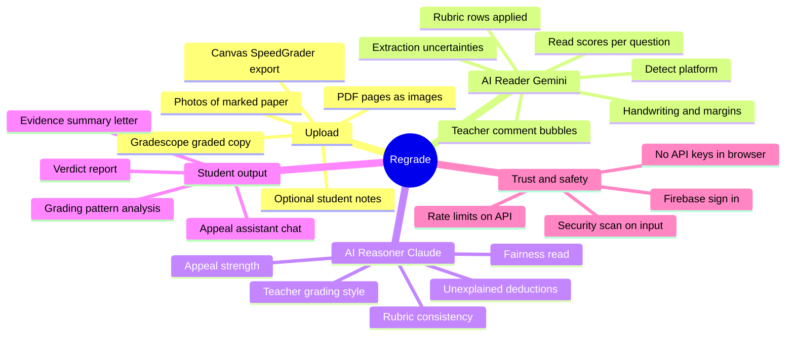
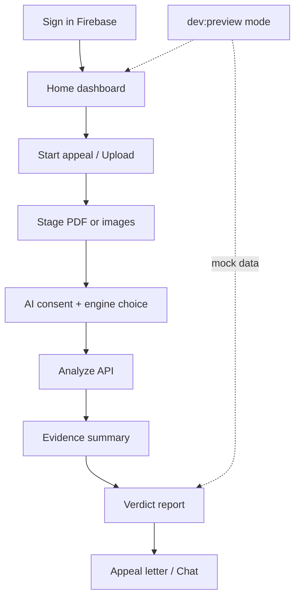
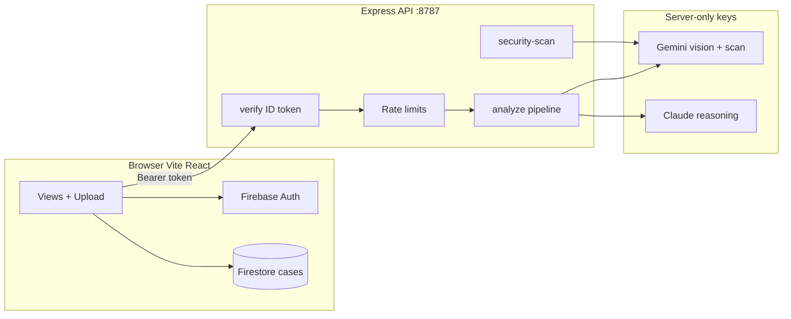
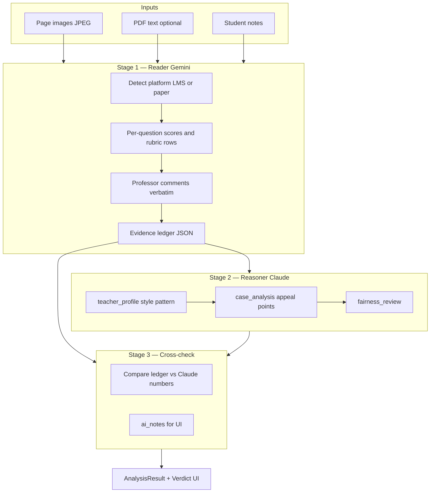
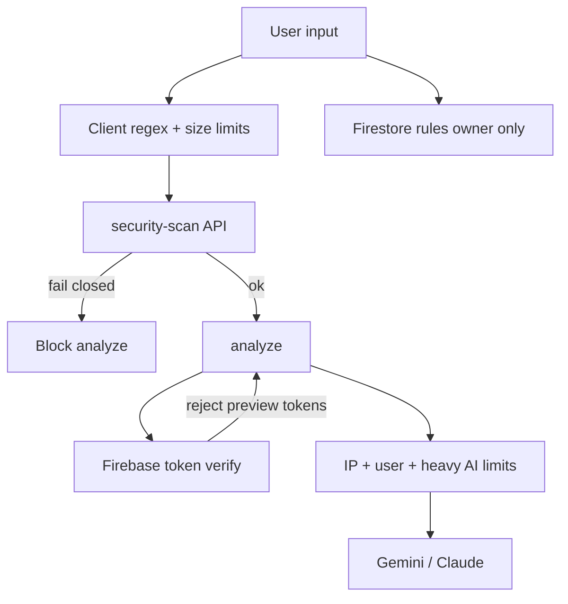
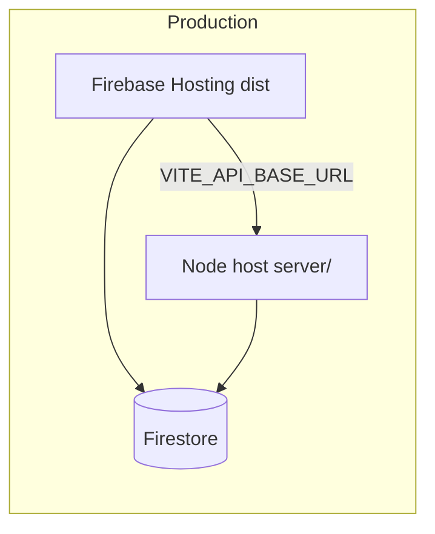

# Regrade

> An AI-assisted grade-appeal assistant for students. Upload graded coursework (Gradescope, Canvas, Moodle, D2L Brightspace, Schoology, Microsoft Teams Education, Google Classroom, Turnitin, or a marked paper), get a rubric-aware analysis, and draft a respectful appeal letter.

**© 2026 Preston Jay Susanto. All rights reserved.** See [`LICENSE`](LICENSE) for source-code terms and [`legal/`](legal/) for the end-user Privacy Policy, Terms of Service, and EULA.

---

## At a glance

| Topic | Summary |
|--------|---------|
| **Who it's for** | Students challenging a grade with evidence from their LMS or marked work |
| **Core flow** | Upload → AI reads marks & comments → fairness + teacher-style analysis → appeal draft |
| **AI stack** | **Gemini** (vision / reading) + optional **Claude** (reasoning) — keys stay on the server |
| **Auth & data** | Firebase Auth + per-user Firestore; API verifies ID tokens |
| **Preview UI** | `npm run dev:preview` — browse the app without Firebase or API keys |
| **Security** | See [`SECURITY.md`](SECURITY.md) for production checklist |

---

## Mind map — what Regrade does



---

## User journey



| Step | Screen | What happens |
|------|--------|----------------|
| 1 | **Auth** | Google or email sign-in; profile synced to Firestore |
| 2 | **Upload** | Files validated (type, size); PDF pages rendered for vision |
| 3 | **Analyze** | Server runs Reader → Reasoner (hybrid) or single-model fallback |
| 4 | **Evidence summary** | Draft appeal context from analysis |
| 5 | **Verdict** | Scores, teacher profile, “How the AI read this”, findings |
| 6 | **Chat** | Advocate assistant (scanned messages, same API auth) |

---

## System architecture



| Layer | Technology | Secrets |
|-------|------------|---------|
| Client | React 19, Vite, Tailwind | `VITE_FIREBASE_*` only (public web config) |
| API | Express, Helmet, CORS, Zod | `GEMINI_API_KEY`, `ANTHROPIC_API_KEY`, Admin SDK |
| Database | Firestore | Rules in `firestore.rules` |
| Hosting | Firebase Hosting | `dist/` static build |

---

## Hybrid AI pipeline (how data is dug out)

Default **Hybrid** mode uses two stages. The Reader **does not** judge fairness; it only extracts what is visible. The Reasoner infers **teacher style** and appeal strength from that ledger.



| Stage | Model | Input | Output (main fields) |
|-------|--------|--------|----------------------|
| **1 — Reader** | Gemini 2.5 Flash | Images + text + notes | `questions[]`, `professor_comments`, `rubric_items_applied`, `source_platform`, `extraction_uncertainties` |
| **2 — Reasoner** | Claude | Ledger + text + notes | `teacher_profile`, `case_analysis`, `fairness_review`, `strongest_appeal_points` |
| **3 — Cross-check** | Code | Ledger vs Claude | `ai_notes.disagreements`, confidence adjustment |

Prompt sources: `shared/extractionSystemPrompt.ts`, `shared/reasoningSystemPrompt.ts`, `shared/platformReadingGuide.ts` (mirrored under `server/src/shared/`).

### AI engine modes

| Mode | Reader | Reasoner | When used |
|------|--------|----------|-----------|
| **hybrid** | Gemini | Claude | Default; needs both API keys |
| **gemini** | Gemini | Gemini single-shot | No Anthropic key or hybrid disabled |
| **claude** | Claude single-shot | — | User choice; full pass in Claude |

User preference: **Profile → AI Engine** + first-run consent before Analyze.

---

## Supported platforms (what the Reader looks for)

| Platform | `source_platform` | Where comments & marks usually live |
|----------|-------------------|-------------------------------------|
| Gradescope | `gradescope` | Blue bubbles on PDF; rubric panel; score summary (negative scoring default) |
| Canvas | `canvas` | SpeedGrader pins; rubric grid; assessment comment box |
| Moodle | `moodle` | Feedback table; rubric levels; annotated PDF |
| Blackboard | `blackboard` | Inline grading bubbles; rubric scorecard |
| D2L Brightspace | `brightspace` | Evaluation panel; achievement rubric |
| Google Classroom | `google_classroom` | Margin chips on returned files; grading panel |
| Turnitin | `turnitin` | QuickMarks + rubric (not similarity % alone) |
| Marked paper | `paper` | Pen marks, circled scores, margin handwriting |
| Schoology / Teams | `schoology`, `teams` | Checklist rubric + feedback text |

**Best upload:** graded PDF with **both** the marked file and rubric/score visible (e.g. Gradescope “Download Graded Copy”).

---

## Teacher profile (grading style on Verdict)

After Stage 2, the **Grading Pattern Analysis** block shows synthesized fields:

| Field | Values / meaning |
|-------|------------------|
| `grading_style` | generous · moderate · harsh · inconsistent |
| `grading_style_evidence` | Short quote citing real point values & comments from the ledger |
| `uses_rubric_consistently` | Whether rubric rows match deductions |
| `feedback_quality` | detailed · adequate · minimal · absent |
| `deduction_pattern` | rubric_based · comment_based · unexplained · mixed |
| `marking_philosophy` | perfectionist · standards_based · effort_rewarding · outcome_focused · unclear |
| `typical_ceiling_estimate` | Rough % cap from visible pattern only (not official policy) |

UI sections tied to analysis JSON:

| Verdict section | JSON source |
|-----------------|-------------|
| How the AI read this | `ai_notes` (extraction / reasoning / cross-check) |
| Grading Pattern Analysis | `teacher_profile` |
| Fairness read | `case_analysis.fairness_review` |
| Critical findings | `case_analysis.unexplained_deductions`, calculation errors |
| Platform badge | `source_platform` |

---

## API routes (authenticated)

All `/v1/gemini/*` routes require `Authorization: Bearer <Firebase ID token>`.

| Method | Path | Purpose | Rate limit |
|--------|------|---------|------------|
| `GET` | `/health` | Liveness | Public |
| `POST` | `/v1/gemini/analyze` | Full analysis pipeline | Heavy AI bucket |
| `POST` | `/v1/gemini/security-scan` | Input safety check | Global |
| `POST` | `/v1/gemini/advocate` | Chat assistant | Heavy AI bucket |
| `POST` | `/v1/feedback` | Feedback (needs `API_KEYS` in prod) | Global |

---

## Security overview



| Control | Location |
|---------|----------|
| Default deny Firestore | `firestore.rules` |
| Field allowlists + size bounds | `firestore.rules` |
| CORS allowlist required in prod | `server/src/env.ts` |
| MIME allowlist for images | `server/src/security/inputGuards.ts` |
| DOMPurify + scan on chat/notes | `src/lib/sanitize.ts`, `securityScanner.ts` |
| Full checklist | [`SECURITY.md`](SECURITY.md) |

---

## What's in this repo

| Folder | Purpose |
|--------|---------|
| `src/` | Vite + React 19 web client (Firebase Auth, Firestore; analyzes via server proxy). |
| `server/` | Express API: Firebase ID verification, rate limits, and AI pipeline (Gemini and optional Claude). |
| `shared/` | System prompts; keep in sync with **`server/src/shared/`** (same files copied for Node builds on all platforms). |
| `public/legal/` | Public HTML versions of the Privacy Policy and Terms — store-review URLs. |
| `legal/` | Markdown master copies of Privacy Policy, Terms of Service, and EULA. |
| `firestore.rules` | Per-user Firestore security rules. |
| `SECURITY.md` | Production security checklist and control summary. |
| `firebase.json` / `.firebaserc` | Firebase Hosting + project mapping for the web build. |

The original `FIREBASE_SETUP.md` covers Firebase project setup in detail.

---

## Run locally

```bash
# 1. install
npm install
npm --prefix server install

# 2. configure
cp .env.example .env                  # fill VITE_FIREBASE_* (see FIREBASE_SETUP.md)
cp server/.env.example server/.env    # GEMINI_API_KEY + Firebase Admin (+ optional ANTHROPIC_API_KEY)

# 3. start (two terminals)
npm run dev:api                       # terminal 1 — Express API on :8787
npm run dev                           # terminal 2 — Vite on :3000
```

The Vite dev server proxies `/api/*` to the Express server on `127.0.0.1:8787`, so the client uses `/api/v1/gemini/...` without extra config.

| Command | URL | Needs Firebase / API? |
|---------|-----|------------------------|
| `npm run dev` | http://localhost:3000 | Yes for real analyze |
| `npm run dev:preview` | http://localhost:3000 | **No** — mock user + sample verdict |
| `npm run dev:api` | http://127.0.0.1:8787 | Keys in `server/.env` |

**Quick checks:** If the API is not running or `GEMINI_API_KEY` is empty, you can still browse with **`npm run dev:preview`**, but live **Analyze** and **security scans** need `npm run dev:api` with a real key.

### Server credentials (`server/.env`)

| Variable | Required | Role |
|----------|----------|------|
| `GEMINI_API_KEY` | Prod yes | Vision Reader + security scan + Gemini-only path |
| `ANTHROPIC_API_KEY` | No | Hybrid / Claude-only reasoning |
| `HYBRID_ENABLED` | No (default `true`) | Kill switch → force Gemini-only |
| `FIREBASE_SERVICE_ACCOUNT_JSON` or `GOOGLE_APPLICATION_CREDENTIALS` | Yes for auth routes | Verify ID tokens |
| `CORS_ORIGIN` | Prod: explicit URLs | Never `*` in production |
| `API_KEYS` | Prod yes for feedback | Protects `POST /v1/feedback` |

---

## Preview the built app

After `npm run build`:

```bash
npm run dev:api     # terminal 1 — keep Express on :8787
npm run preview     # terminal 2 — Vite preview (often http://localhost:4173)
```

Use the same Firebase + `server/.env` setup as dev for sign-in and live analysis.

---

## Build

```bash
npm run lint                  # tsc on src/ only (tsconfig.app.json)
npm run build                 # produces dist/
npm --prefix server run lint  # server TypeScript check
npm --prefix server run build # compiles server to server/dist/
```

The web `dist/` is what Firebase Hosting serves and what Capacitor wraps for the iOS and Android stores.

---

## Deploy

### Web (Firebase Hosting)

```bash
npm run deploy:hosting   # vite build → firebase deploy --only hosting:regrade
npm run deploy:rules     # firestore.rules → Firebase
```

The Express server in `server/` cannot run on Firebase Hosting. Deploy it to a Node host (Render, Fly.io, Google Cloud Run, etc.) and build the client with `VITE_API_BASE_URL=https://<your-api-host>` so the production bundle calls the right URL.



### Mobile (Capacitor → App Store / Play Store)

1. Add Capacitor: `npx cap init "Regrade" app.regrade.client --web-dir=dist`.
2. `npm run build && npx cap add ios && npx cap add android && npx cap sync`.
3. Register bundle id / package in Firebase; add `GoogleService-Info.plist` and `google-services.json`.
4. Sign with Apple Developer team and Android release keystore.
5. Upload to Play Console and App Store Connect.

Full steps: `FIREBASE_SETUP.md` (“Mobile wrapper”).

---

## Legal

This repository is **proprietary**. The source code is licensed under the terms in [`LICENSE`](LICENSE). Authorized contributors (interns, contractors) must sign a CIIAA and NDA **before** repo access — see [`CONTRIBUTING.md`](CONTRIBUTING.md).

| Document | Path |
|----------|------|
| Contributor / intern policy | [`CONTRIBUTING.md`](CONTRIBUTING.md) |
| Privacy Policy | [`legal/PRIVACY_POLICY.md`](legal/PRIVACY_POLICY.md) · [public](public/legal/privacy.html) |
| Terms of Service | [`legal/TERMS_OF_SERVICE.md`](legal/TERMS_OF_SERVICE.md) · [public](public/legal/terms.html) |
| EULA | [`legal/EULA.md`](legal/EULA.md) |
| Third-party notices | [`NOTICE.md`](NOTICE.md) |

Public URLs (store review):

- https://regrade.app/legal/privacy.html  
- https://regrade.app/legal/terms.html  

Update the “Last updated” date in **all six** legal files plus `src/version.ts` whenever you make a material change.

---

## Branding

| Item | Value |
|------|--------|
| App name | Regrade |
| Copyright | © 2026 Preston Jay Susanto. All rights reserved. |
| Bundle id / package | `app.regrade.client` |
| Support email | `src/version.ts` → `APP_SUPPORT_EMAIL` |

Trademark notice: LMS names (Canvas, Gradescope, Moodle, etc.) and **Gemini** (Google LLC) / **Claude** (Anthropic PBC) are trademarks of their respective owners. Regrade is not affiliated with those companies beyond normal API use.

---

## Versioning

| File | What to bump |
|------|----------------|
| `src/version.ts` | `APP_VERSION` (source of truth) |
| `package.json` | `version` |
| `legal/*`, `public/legal/*` | “Last updated” |
| iOS / Android (Capacitor) | `CFBundleVersion` / `versionCode` every store upload |

Apple and Google require monotonically increasing build numbers on each upload.
