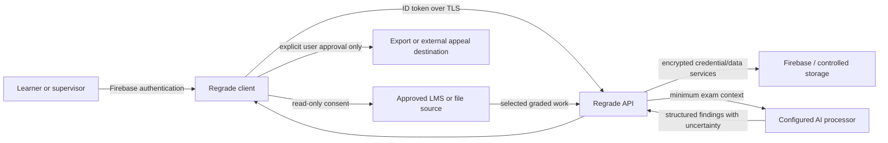

# School security package index

Status: draft for institutional review; not a certification.

## Contents to send

1. `SCHOOL_ADMIN_ONE_PAGER.md`
2. `PILOT_IMPLEMENTATION_PLAN.md`
3. `../security/SCHOOL_SECURITY_QUESTIONNAIRE.md`
4. `../legal/SCHOOL_DATA_PROCESSING_OVERVIEW.md`
5. Privacy policy, Terms, AI disclosure, parent/school consent summary
6. Connector-specific OAuth scopes and redirect URIs
7. Current subprocessor inventory and hosting regions (must be completed from signed vendor accounts)
8. Independent penetration-test/SOC evidence when obtained; do not claim it now

## Architecture and data flow

## Baseline controls and evidence state

| Control | Design | Evidence required before pilot |
|---|---|---|
| Authentication | Firebase Auth; server verifies ID token | Two-account isolation and revoked-session test |
| Authorization | User-owned records; Firestore rules | Emulator/production-rules tests for every collection |
| Transport | HTTPS/TLS in production | Deployed endpoint scan |
| At rest | Provider-managed encryption; connector secrets server-side | Confirm production projects, regions and key handling |
| Least privilege | Read-only provider scopes | Connector-by-connector approved scope inventory |
| Deletion | In-app account/exam deletion and provider disconnect | End-to-end cascading deletion evidence |
| Logging | No exam body, token or raw personal data in logs | Production log review/redaction test |
| AI | Findings are suggestions; no training claim until processor contract/settings prove it | Signed processor terms and configured retention/training settings |
| Incident response | Contact: regradeteam@gmail.com | Named on-call owner, severity matrix and notification procedure |

Do not answer “yes” to certifications, audits, cyber insurance, data-residency, backup RPO/RTO or subprocessor contractual terms until documentary evidence exists.
