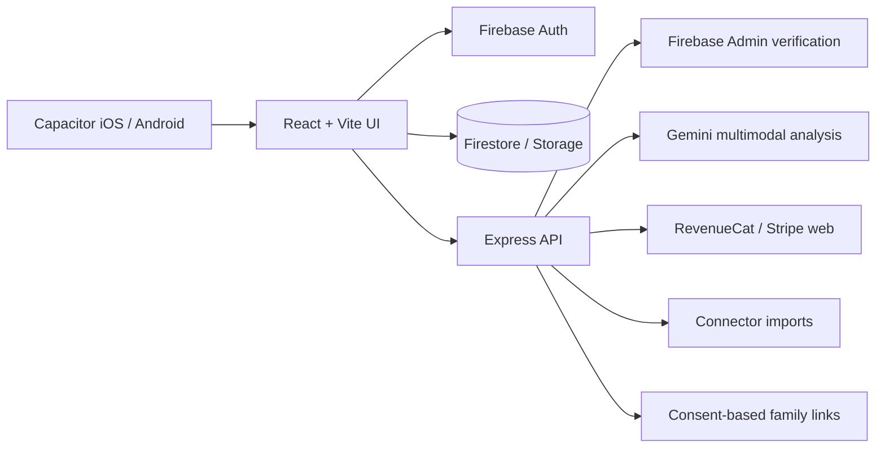
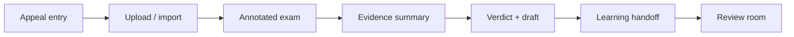

# Regrade Project Overview

Audit date: July 11, 2026  
Owner: Preston Jay Susanto  
Scope: Current Regrade client, API, native wrappers, storage rules, and user flows before the Regrade 2.0 UI refactor.

## Product purpose

Regrade is an evidence-first student assistant. A student uploads or imports marked work, the AI extracts scores, rubric items, teacher feedback, and visible uncertainties, and Regrade helps the student understand the result, identify a defensible grading issue, prepare a respectful appeal, and turn exam evidence into a personal review plan. A supervisor account can support a learner only after pairing and learner approval.

## Repository structure

| Path | Responsibility |
| --- | --- |
| `src/` | React 19 client, views, navigation, local preview fixtures, Firebase client services, connector UI, subscriptions, notifications, and themes |
| `src/views/` | Page-level product surfaces: Dashboard, Appeal, Coach, Review, History, Profile, paper viewer, annotations, evidence, verdict, and supervisor hub |
| `src/components/` | Shared navigation, auth/onboarding pieces, tutorial, chat renderer, appeal flow pieces, controls, loading states, and brand elements |
| `src/services/` | Cases, profiles, subscriptions, purchases, notifications, automation, connections/imports, sessions, family pairing, feedback, and account deletion |
| `src/features/connect/` | Searchable platform catalog, connection flows, secure connection store, and connector-specific UI |
| `shared/` | Canonical AI prompts, platform-reading guidance, and deterministic grading audit shared with the API |
| `server/src/` | Express API, Firebase Admin, Gemini pipeline, billing, automation, imports, family sharing, account deletion, middleware, and security controls |
| `public/` | Brand assets, platform marks, legal pages, OAuth callback, and Gradescope instructions |
| `ios/`, `android/` | Capacitor native wrappers and store-specific configuration |
| `legal/`, `docs/` | Legal source documents and operational/product documentation |
| `scripts/` | Deployment, Capacitor preparation, screenshots, and launch-document tooling |

## Runtime architecture

The client is a single-page application. `AuthGate` chooses between boot splash, authentication, onboarding, verification, and the authenticated app. `App.tsx` owns the active product tab and the appeal-flow state machine. Large views are lazy-loaded. `Layout.tsx` owns the header, five-tab bottom navigation, notification badge state, and initial automation check.

## Navigation and primary flows

The primary navigation has five stable destinations:

1. **Home**: personalized entry point and shortcuts.
2. **Appeal**: new or existing evidence-based appeal.
3. **Coach**: Mr Whale agent sessions.
4. **Review**: exam-only learning patterns and study actions.
5. **History**: saved and completed appeal record.

Profile is accessed from the top-right menu and is divided into My Profile, Connections, Plan & Usage, Mr Whale & Alerts, and Settings & Account.

The appeal flow is a state machine rather than URL routing:

## State management

- React component state controls navigation, appeal steps, dialogs, filters, onboarding, tutorial state, and agent tabs.
- Firebase Auth is the identity source.
- Firestore/Storage hold production profiles, cases, uploads, billing snapshots, connection metadata, and sharing records under owner-scoped rules.
- API endpoints perform privileged AI, credential, billing, automation, import, and family operations.
- No synthetic runtime mode exists; test data belongs only in isolated automated-test fixtures.
- Theme preference is held in a React context and synchronized to the user profile.
- There is no Redux or equivalent global store.

## Authentication and account lifecycle

- Email/password creation and sign-in.
- Google and Apple sign-in.
- Password reset and email verification.
- New-account onboarding captures account role, name, optional institution, and optional connector.
- Explicit sign-out and server-backed complete account deletion.
- Public Terms, Privacy, EULA, support, and deletion-help links.

## Backend and security boundaries

- Firebase ID-token verification and optional App Check enforcement.
- Helmet, CORS restrictions, request IDs, Zod validation, per-user/IP rate limits, and separate AI limits.
- AI consent middleware and server-side model credentials.
- MIME/size validation and security scanning for uploaded content.
- Encrypted connector credentials, Canvas URL guards, PKCE for applicable providers, and server-side revocation.
- Default-deny Firestore and Storage rules.
- HMAC-protected, short-lived learner pairing codes with learner approval.
- Usage entitlement and quota enforcement on the server.

## Build and footprint baseline

The working folder measured approximately **870 MB**, but this is not the installed application size:

- Root `node_modules`: ~535 MB
- Server `node_modules`: ~148 MB
- Android working/build directories: ~130 MB
- Client production web build: ~6.5 MB
- Source, public assets, and documentation: only a small fraction of the total

The cleanup strategy must distinguish developer dependencies and caches from the shipped binary. Removing source or runtime capability to reduce the repository number would be counterproductive; generated build outputs and duplicated installation trees are the correct first targets.

## Important constraints for the refactor

- Preserve the five product destinations and direct access to Appeal.
- Preserve the full evidence-to-draft appeal state machine.
- Preserve Review's evidence-only and exam-only promises.
- Preserve supervisor consent boundaries.
- Preserve connection search and manual-upload fallback.
- Preserve subscription enforcement, automation preferences, notification controls, legal/account actions, dark mode, and reduced motion.
- Avoid copying Wispr Flow trademarks, proprietary illustrations, exact screens, or inaccessible font files. Regrade can adopt the observed principles while keeping its own brand and content.
